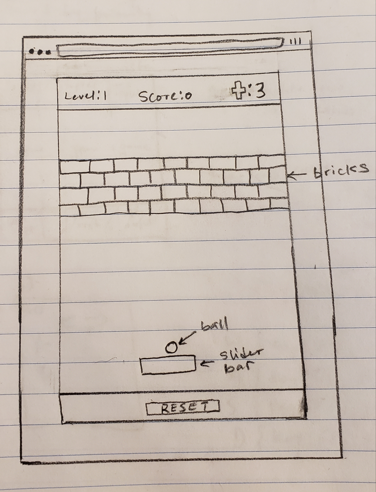
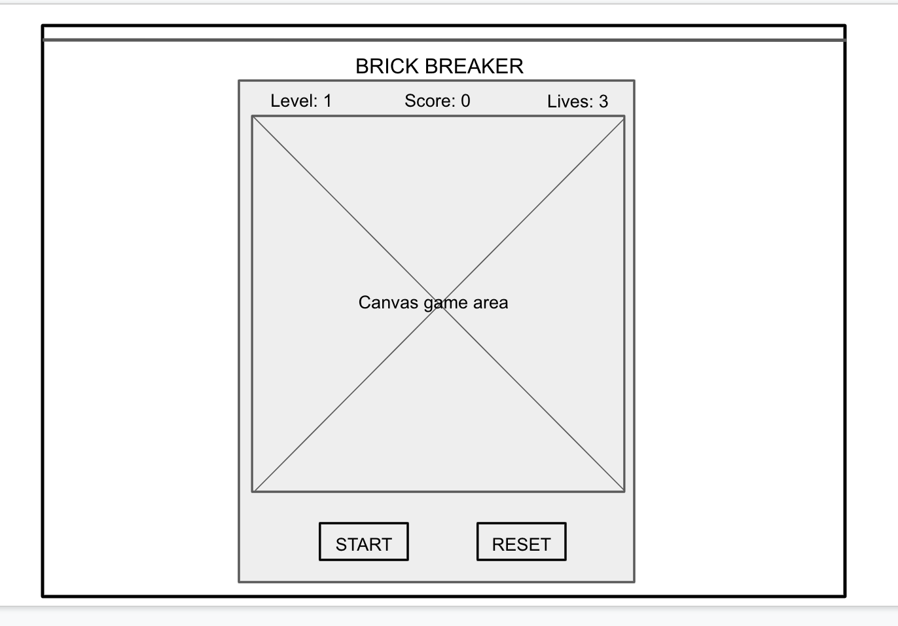
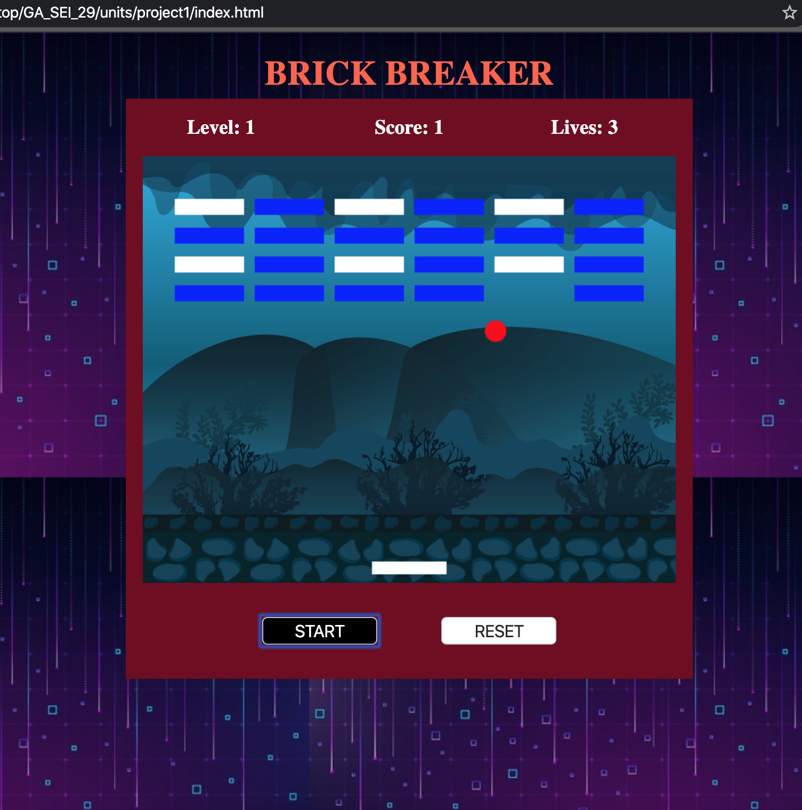
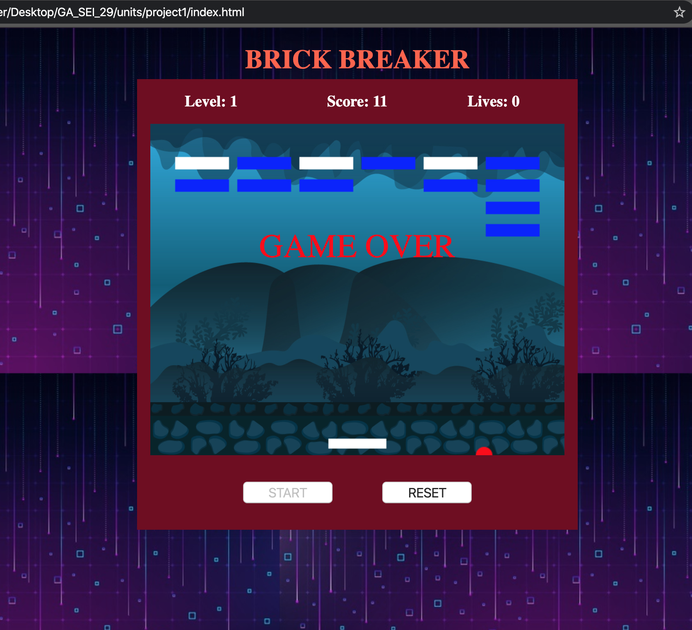

## Brick Breaker
Brick breaker game for Project 1 at General Assembly, SEI-29

[Game Demo](/segwuonwu.github.io/Brick-Breaker/)

## Wireframes

## Initial game planning
After deciding what my project would be, I started thinking of what technologies to use and how to get started. I was going to use HTML5, CSS, JavaScript, jquery and bootstrap for making the game board and loggics. But after I did some research I find out it will be easy for me to use canvas instead of jquery and bootstrap.
I made a rough sketch of how I want my game board to look like and what variables and function I'll need to declare.

## Putting it all together
I started the website design by laying out my HTML elements, then came the styling with CSS which took me awhile because styling is not my strongest suit. I then began planning my game loggics in Javascript. I first made prototypes of some of the functions that I needed and decleared some variables. I drew all my objects on canvas. I spent some time trying to figure out how to make my ball,paddle to move and how to apply keyboard functionality to my paddle movement, as some I got them working I moved on to working on my collision detection loggic which took pretty much most of my time. As soon as got the collision detection working I then implemented my win/lose condition, score and live tracking, and instruction which didn't take me that long. Then finally decided to add some background and sounds to the game.

## Technologies used
* HTML
* CSS
* Canvas
* Javascript

## My MVP
* Instructions at the start of the game
* Start button
* Reset button
* Win/lose condition
* Collision detection
* Keyboard controls
* paddle bar
* Ball
* Bricks
* Lives

## My Stretch Goal
* Score tracking
* Sound
* mutiple levels
* Add multiple hits to some bricks

## External resources
* W3Schools
* css-tricks
* stack overflow
* developer.mozilla.org

